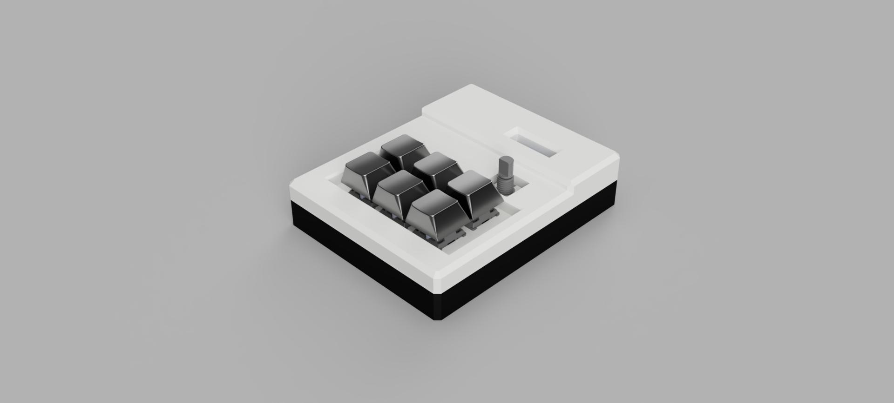
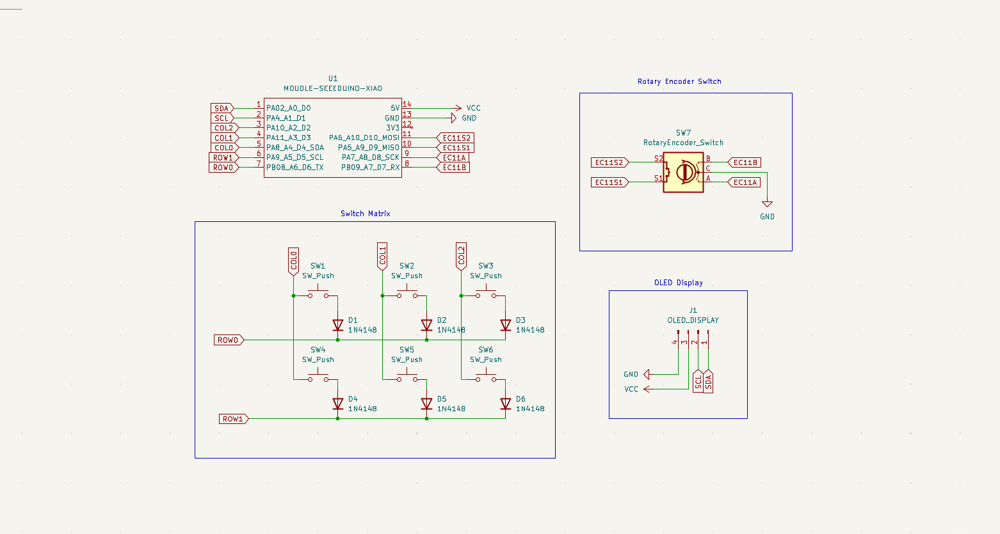
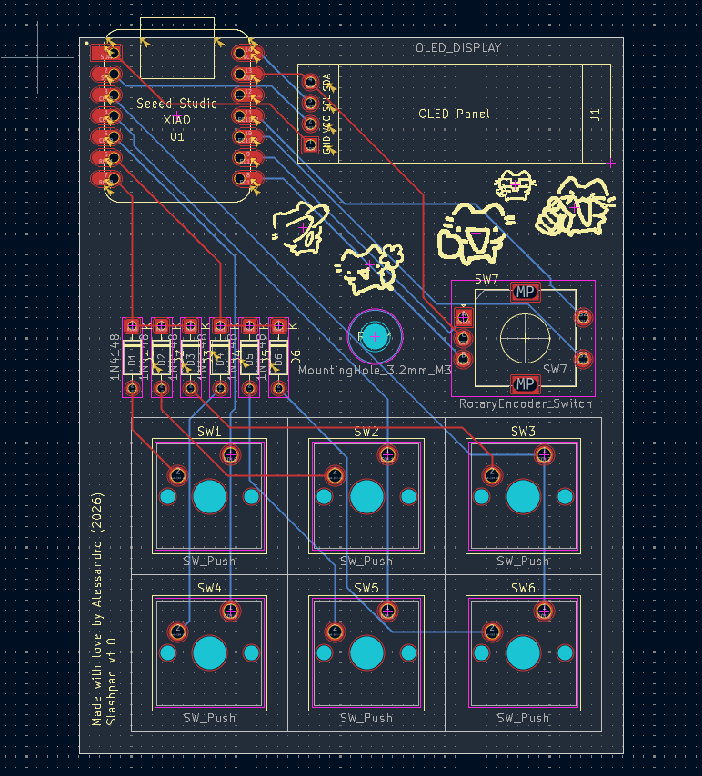
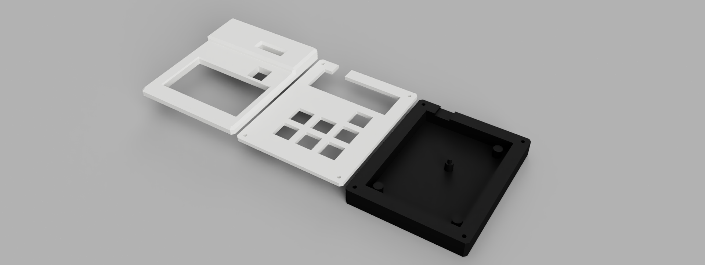

## Slashpad

This is my submission for the Hackpad challenge!

Slashpad is a 6 key macropad with a Rotary Encoder and OLED Display, and uses the QMK Firmware!

--- 
### Inspiration for the name of the pad

I named the pad after my username online! As you can see, my name on github is "fireslash88" and that's pretty much the same for every other account I have online!
I have another username that I actually use more than this one but I prefer to use slash now..

---
### BOM
- 1x Seeed XIAO RP2040
- 6x Cherry MX Switches
- 6x Keycaps
- 1x EC11 Rotary Encoder
- 1x 0.91 inch OLED display
- 7x through-hole 1N4148 Diodes
- 4x M3x16mm screws
- 1x 3D Printed Case
---
### PCB
This is the PCB I created for the Multipad!

This is the schematic that I created using KiCad 10.0!

This is the PCB!

---
### Case
This is the case I modeled in Fusion 360!

---
### Firmware

The Slashpad uses the QMK firmware for everything!
(Will include VIA in the future) 

---
### Thanks!

A great thanks to Hack Club to have made this project possible!

---

### Cats
Yes. I love cats so I decided to put some silly cats I found on Pinterest on the PCB. They're pretty and I love them so uhh... Yeah... Cats.. Meow..
